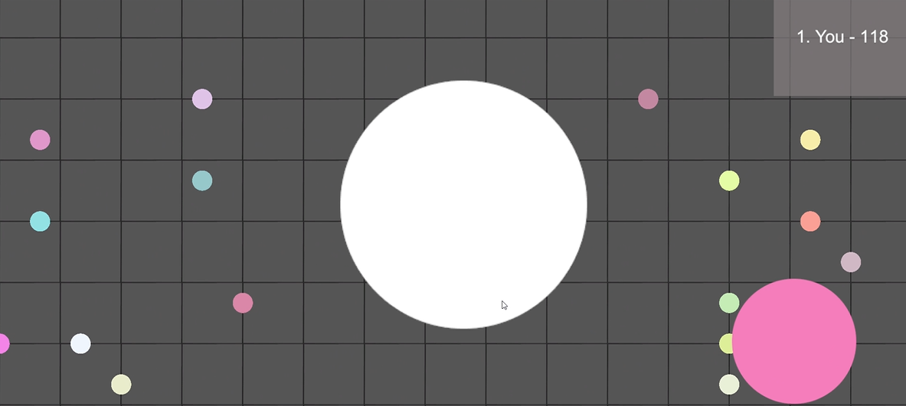

# glutton-io

An online multiplayer game where you grow a cell in a Petri dish.

Watch a video the team introducing the game [here](https://youtu.be/Cyrz-GboFE8) :)

## FPGA

To setup the FPGA, refer to the guide in [`fpga/README.md`](fpga/README.md).

## Game

To compile the game, Unity 2022.3.20f1 is required (some other versions may 
work as well). 

## Server (AWS)

To run the server locally, follow the instructions in 
[`server/README.md`](server/README.md).

