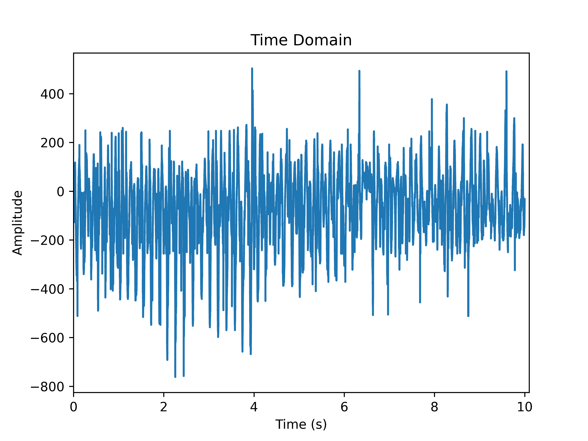
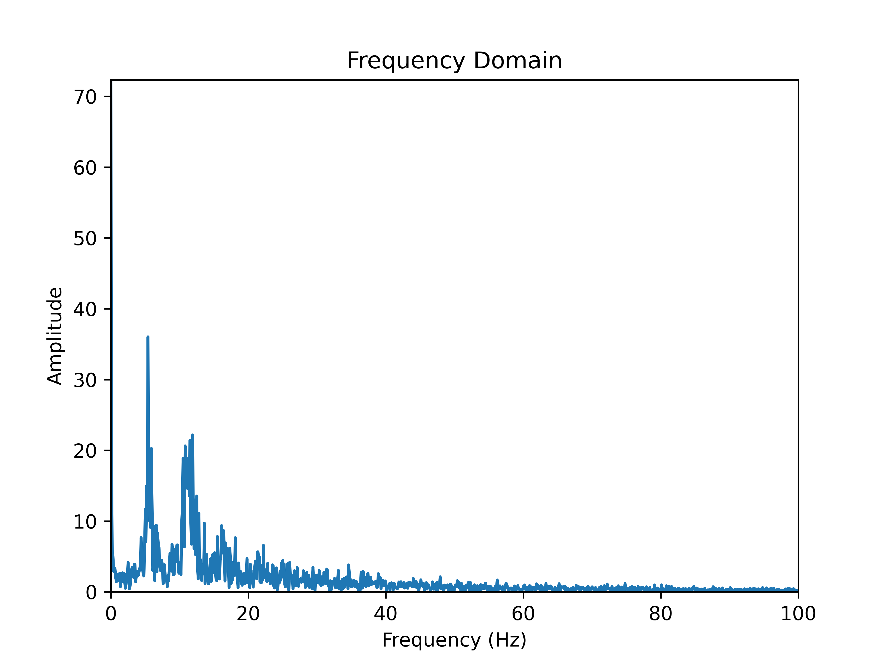

# FPGA Simulator

## Usage

For all scripts, run `python3 <script.py> --help` for detailed usage 
information.

[`main.py`](main.py) simulates an FPGA and outputs data to the host.

[`fir_data.py`](fir_data.py) collects, measures and analyses real data
from a real FPGA.

[`fir_tester.py`](fir_tester.py) tests the FIR coefficients with simulated
data. 

[`latency_data.py`](latency_data.py) collects and analyses the latency from
UART.

## Report

### Finding the sample rate 

Using [`fir_data.py`](fir_data.py) we can get the sampling rate of the
accelerometer by collecting as many samples in 10 seconds.

```console
$ python3 fir_data.py --measure

Measured sample rate: 5291.7 Hz
```

There was a range, depending on how fast the accelerometer was shaken. This
ranged from 4600 Hz to 7300 Hz. (avg $\approx$ 6000 Hz). 

However, this turned out to be misleading as when the data was collected,
it turned out that data would be clumped in groups of approximately 40-70,
suggesting a sampling rate of 100 Hz.

```console
$ python3 fir_data.py --collect
```

Under further investigation by delving into the 
[datasheet of the ADXL345](https://www.analog.com/media/en/technical-documentation/data-sheets/adxl345.pdf)
(the accelerometer used on the DE10) and through experimentation:

```c
// In the Nios II code

alt_u8 result;
// 0x2c controls the sampling frequency - see datasheet
alt_up_accelerometer_spi_read(acc_dev, 0x2c, &result);
printf("Read from register: %d\n", result); 
```
```console
Read from register: 10
```

which corresponds to 0b1010 and by looking at Table 7 of the datasheet, this 
corresponds to 100Hz - exactly that found by experimentation.

### Boosting the sample rate

Studies have shown humans percieve can percieve a latency of around 10-100 
ms. Most wired controllers have a latency of up to 10ms. 

> Note: An FIR filter introduces a group delay of 
$\frac{N-1}{T_s} = -\frac{d\phi}{d\omega}$ seconds. 

To minimise the delay, we need to reduce the sampling time, therefore we select
the highest sampling frequency. The accelerometer can sample up to 3200 Hz and
therefore, we select that by writing to that certain register the magic code, 
found in the datasheet.

```c
alt_up_accelerometer_spi_write(acc_dev, 0x2c, 0b1111);
```

This was tested again and using the same method and the claim was found to be
substantiated.

### Selecting the FIR filter coefficients

To minimise delay, we need to maximise $d\omega$, but that 
increases HF noise, so there is a compromise between reducing noise 
and latency.

Our goal is a controller delay of no more than 10ms. As the sampling frequency
is 3.2kHz, we can create up to a 64-tap filter (see above equation).

To see what noise is being recieved, we can analyse the data received from the FIR
data, and take a FFT to view the signal in the frequency domain.

```console
$ python3 fir_data.py --analyse
```

| Time | Frequency
|-|-|
 | 

Natural movements stop from 10 Hz. Therefore we attentuate anything after that.

MatLab was used to generate the coefficients. A sampling rate of 3.2 kHz was
assumed.

### Testing the FIR filter coefficients

